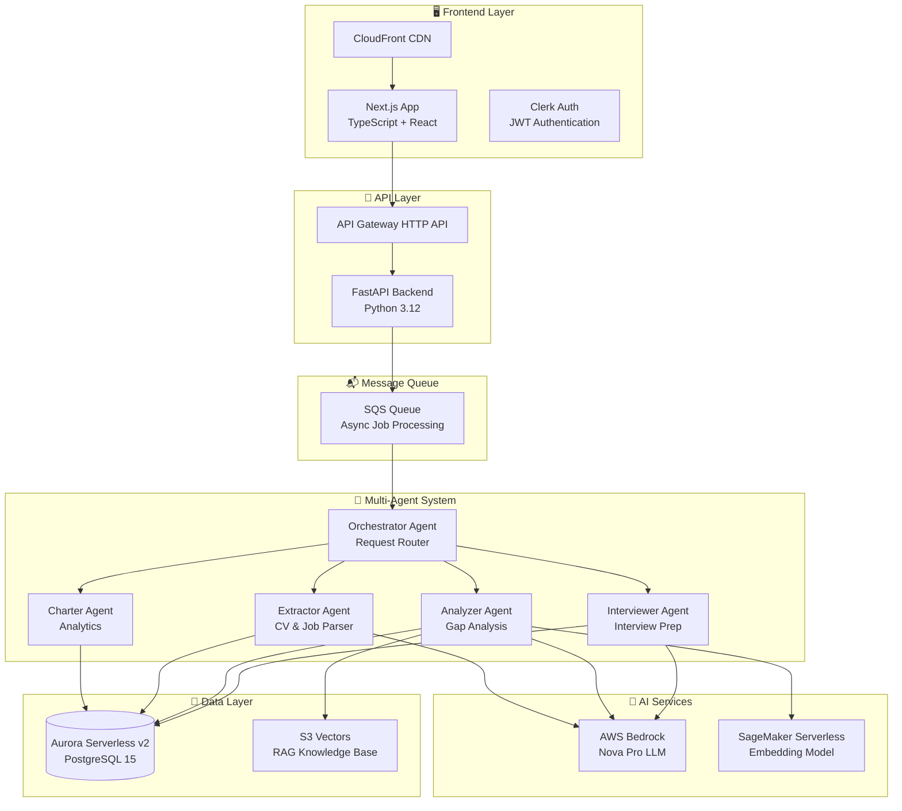

# CareerAssist - Enterprise AI Career Platform

> A production-ready, multi-agent AI system built on AWS serverless architecture to help job seekers optimize their careers through intelligent CV analysis, interview preparation, and application tracking.

<div align="center">

[](https://aws.amazon.com/)
[](https://www.python.org/)
[](https://www.typescriptlang.org/)
[](https://www.terraform.io/)
[](https://www.postgresql.org/)

**[Architecture](#architecture) • [Features](#features) • [Tech Stack](#tech-stack) • [Deployment](#deployment)**

</div>

---

## 🎯 Project Overview

**CareerAssist** is a sophisticated AI-powered career platform demonstrating enterprise-grade software engineering practices. This personal project showcases expertise in:

- **Multi-Agent AI Architecture** - 5 specialized AI agents coordinating via event-driven orchestration
- **AWS Serverless Infrastructure** - Lambda, App Runner, SageMaker, Bedrock, Aurora Serverless v2
- **Infrastructure as Code** - Modular Terraform with independent state management
- **Full-Stack Development** - Next.js frontend, FastAPI backend, PostgreSQL database
- **Vector RAG System** - Custom S3-based vector storage with semantic search
- **Enterprise Security** - JWT authentication, IAM least privilege, VPC isolation

### What It Does

CareerAssist helps job seekers through AI-powered assistance:

- 🎯 **CV Optimization** - ATS-friendly rewrites tailored to specific job postings
- 📊 **Gap Analysis** - Detailed fit scoring (0-100) with actionable improvement suggestions
- 🎤 **Interview Preparation** - AI-generated questions based on role and company
- 📈 **Application Tracking** - Analytics dashboard with success rate insights

---

## 🏗️ Architecture

### High-Level System Design



### Multi-Agent Orchestration

CareerAssist implements a **specialized agent architecture** where each AI agent handles a specific domain:

| Agent | Purpose | Technology | Key Features |
|-------|---------|------------|--------------|
| **Orchestrator** | Routes requests to specialist agents | OpenAI Agents SDK + Bedrock | Lambda invocation, error handling, result aggregation |
| **Extractor** | Parses CVs and job postings into structured data | Structured Outputs | NER extraction, schema validation |
| **Analyzer** | Gap analysis and CV rewriting | RAG + Vector Search | Fit scoring (0-100), ATS optimization, template matching |
| **Interviewer** | Interview question generation and evaluation | Knowledge Base RAG | Behavioral/Technical/Situational questions, STAR method |
| **Charter** | Application analytics and visualizations | SQL + Bedrock | Success rate tracking, funnel analysis |

**Design Pattern**: Event-driven orchestration with async processing via SQS queues

---

## ✨ Key Features

### 1. CV Optimization Engine

- **Intelligent Parsing**: Extracts skills, experience, education using LLM-powered NER
- **ATS Scoring**: Keyword matching against job requirements (0-100 score)
- **Smart Rewrites**: RAG-powered bullet point optimization using proven templates
- **Version Control**: Maintain multiple CV versions for different roles

### 2. Gap Analysis System

- **Fit Scoring Algorithm**: Multi-dimensional analysis (skills, experience, education, location)
- **Detailed Breakdowns**: Strengths, gaps, and actionable improvement recommendations
- **Keyword Extraction**: Identifies must-have vs. nice-to-have requirements
- **Seniority Matching**: Aligns experience level with role expectations

### 3. Interview Preparation

- **Question Generation**: Tailored to specific role, company, and your background
- **Multi-Category**: Behavioral (STAR method), Technical, Situational, Motivation
- **Answer Evaluation**: AI feedback on clarity, relevance, depth, structure
- **Practice Sessions**: Save interview sessions with progress tracking

### 4. Application Tracking

- **Pipeline Analytics**: Applied → Screening → Interview → Offer funnel
- **Success Metrics**: Response rates by role type, CV version, company
- **Time-to-Response**: Histogram analysis of application turnaround times
- **Skill Gap Insights**: Most frequently missing skills across applications

---

## 🛠️ Tech Stack

### Backend Infrastructure

| Component | Technology | Purpose |
|-----------|-----------|---------|
| **Compute** | AWS Lambda (Docker) | Serverless agent execution |
| **Long-Running** | AWS App Runner | Job market research service |
| **Database** | Aurora Serverless v2 (PostgreSQL 15) | Transactional data storage |
| **Vector Store** | Custom S3 Vectors | Cost-effective RAG knowledge base |
| **LLM** | AWS Bedrock (Nova Pro) | AI agent intelligence |
| **Embeddings** | SageMaker Serverless (HuggingFace) | Semantic search vectors |
| **Orchestration** | SQS + EventBridge | Async job queue + scheduling |
| **API Gateway** | API Gateway HTTP API | RESTful endpoint management |

### Frontend

| Component | Technology |
|-----------|-----------|
| **Framework** | Next.js 14 (TypeScript) |
| **UI Library** | React 18 |
| **Authentication** | Clerk (JWT) |
| **Hosting** | CloudFront + S3 |

### DevOps & Infrastructure

| Component | Technology |
|-----------|-----------|
| **IaC** | Terraform (modular, independent state) |
| **Containerization** | Docker + ECR |
| **CI/CD** | Python deployment scripts |
| **Monitoring** | CloudWatch Logs + Dashboards |
| **Secrets** | AWS Secrets Manager |
| **Packaging** | uv (Python), npm (Node.js) |

---

## 📂 Project Structure

```
CareerAssist/
├── backend/
│   ├── orchestrator/       # Request router agent
│   ├── extractor/          # CV/Job parser agent
│   ├── analyzer/           # Gap analysis + CV rewrite agent
│   ├── charter/            # Analytics agent
│   ├── interviewer/        # Interview prep agent
│   ├── researcher/         # Job market research (App Runner)
│   ├── ingest/             # Document ingestion Lambda
│   ├── database/           # Shared PostgreSQL library
│   │   ├── migrations/     # SQL schema migrations
│   │   └── src/database/   # Database operations
│   └── api/                # FastAPI backend for frontend
│
├── frontend/               # Next.js React application
│   ├── src/
│   │   ├── app/           # Next.js 14 App Router
│   │   ├── components/    # React components
│   │   └── lib/           # Utilities
│   └── public/            # Static assets
│
├── terraform/              # Infrastructure as Code (modular)
│   ├── 2_sagemaker/       # Embedding endpoint
│   ├── 3_ingestion/       # S3 Vectors + Ingest API
│   ├── 4_researcher/      # App Runner service
│   ├── 5_database/        # Aurora Serverless v2
│   ├── 6_agents/          # Lambda agents + SQS
│   ├── 7_frontend/        # CloudFront + API Gateway
│   └── 8_enterprise/      # CloudWatch monitoring
│
├── design-log/             # Architectural decision records (ADRs)
│   ├── architecture/      # System-wide decisions
│   ├── agents/            # Agent-specific choices
│   └── infrastructure/    # AWS/Terraform decisions
│
└── scripts/                # Deployment automation
    ├── deploy.py          # Frontend deployment
    ├── package_docker.py  # Lambda packaging
    └── deploy_all_lambdas.py  # Batch agent deployment
```

---

## 🚀 Deployment

### Prerequisites

- **AWS Account** with appropriate permissions
- **Docker Desktop** (required for Lambda packaging)
- **Node.js 18+** and **Python 3.11+**
- **uv** (Python package manager)
- **Terraform 1.5+**

### Quick Start

Deploy the infrastructure modules in order using Terraform:

1. **Permissions** - Set up AWS IAM permissions
2. **SageMaker** - Deploy SageMaker embedding endpoint (`terraform/2_sagemaker`)
3. **Ingestion** - Configure S3 vector storage + ingestion API (`terraform/3_ingestion`)
4. **Researcher** - Deploy App Runner research agent (`terraform/4_researcher`)
5. **Database** - Provision Aurora Serverless v2 database (`terraform/5_database`)
6. **Agents** - Deploy Lambda AI agents + SQS queue (`terraform/6_agents`)
7. **Frontend** - Deploy Next.js frontend + API Gateway (`terraform/7_frontend`)
8. **Monitoring** - Add CloudWatch monitoring (`terraform/8_enterprise`)

### Local Development

```bash
# Python environment (always use uv)
uv add package-name
uv run python script.py

# Test agents locally (with mocks)
cd backend/analyzer
uv run test_simple.py

# Package Lambda functions
uv run backend/package_docker.py

# Deploy all agents
uv run backend/deploy_all_lambdas.py

# Frontend development
cd frontend
npm install
npm run dev
```

---

## 🔒 Security & Best Practices

### Infrastructure Security

- **Authentication**: Clerk JWT validation on all API requests
- **IAM**: Least privilege roles for each Lambda function
- **VPC Isolation**: Agents and database run in private subnets
- **Encryption**:
  - At rest: KMS for database and secrets
  - In transit: TLS 1.2 for all communications
- **Secrets Management**: AWS Secrets Manager for database credentials

### Development Practices

- **Testing Strategy**:
  - `test_simple.py` - Local unit tests with mocks
  - `test_full.py` - Integration tests against deployed AWS resources
- **Modular Terraform**: Each directory has independent state (no cross-dependencies)
- **Error Handling**: Dead Letter Queue (DLQ) for failed SQS messages
- **Observability**: CloudWatch Logs with 7-day retention, custom dashboards

---

## 📊 Performance Characteristics

| Metric | Value |
|--------|-------|
| **Cold Start** | < 2 seconds (Lambda with provisioned concurrency) |
| **CV Analysis** | 15-30 seconds (full pipeline) |
| **Vector Search** | < 100ms (S3 Vectors) |
| **Database Queries** | < 50ms (Aurora Data API) |
| **Concurrent Users** | Auto-scales to 1000+ (Lambda concurrency) |
| **Monthly Cost** | ~$20-50 for moderate usage (serverless pricing) |

---

## 🎓 Technical Highlights

### 1. Custom Vector Storage on S3

Instead of managed solutions (Pinecone, Weaviate), I implemented a **custom vector storage system** using S3:

- **Sub-second similarity search** using cosine distance
- **Zero minimum charges** (pay only for S3 storage)
- **Strongly consistent** writes
- **Simple architecture** - no additional services to manage

**Trade-off Decision**: Managed vector DBs offer millisecond latency but have minimum costs ($70+/month). S3 Vectors achieves 100ms latency at 1/10th the cost.

### 2. OpenAI Agents SDK + LiteLLM Integration

Each agent uses the **OpenAI Agents SDK** with **LiteLLM** as an abstraction layer to AWS Bedrock:

```python
from agents import Agent, Runner, trace
from agents.extensions.models.litellm_model import LitellmModel

model = LitellmModel(model=f"bedrock/{model_id}")

with trace("Analyzer Agent"):
    agent = Agent[AnalyzerContext](
        name="Gap Analyzer",
        instructions=ANALYZER_INSTRUCTIONS,
        model=model,
        tools=tools
    )

    result = await Runner.run(agent, input=task, context=context, max_turns=10)
```

**Benefit**: Swap LLM providers (Bedrock, OpenAI, Anthropic) without changing agent code.

**Limitation Handled**: LiteLLM/Bedrock doesn't support Structured Outputs + Tools simultaneously. Solution: Each agent uses one or the other.

### 3. Independent Terraform Modules

Each Terraform directory (`2_sagemaker`, `3_ingestion`, etc.) is **fully independent**:

- Own local state file (`terraform.tfstate`)
- Own `terraform.tfvars` configuration
- No cross-module dependencies

**Why**: Allows partial deployments, easier debugging, and isolated state management.

### 4. Event-Driven Orchestration

Instead of synchronous Lambda chains, CareerAssist uses **SQS-based async orchestration**:

```
User Request → API Gateway → FastAPI → SQS Queue → Orchestrator → [Parallel Agents] → Database
```

**Benefits**:
- Decouples frontend from long-running processes
- Enables retry logic with Dead Letter Queues
- Supports batch processing
- Prevents Lambda timeout cascade failures

---

## 📖 Documentation

- **[AGENTS.md](AGENTS.md)** - Detailed agent architecture and specifications
- **[CLAUDE.md](CLAUDE.md)** - AI assistant context (development workflow)
- **[design-log/](design-log/)** - Architectural Decision Records (ADRs)

---

## 💰 Cost Management

Serverless architecture keeps costs low:

- **Development**: ~$5-10/month (Aurora destroy when not in use)
- **Production**: ~$20-50/month for moderate usage
  - Aurora Serverless: $15-25 (0.5-1 ACU)
  - Lambda: $5-10 (pay per invocation)
  - SageMaker: $3-5 (serverless endpoint)
  - S3 + CloudFront: $2-3

**Tip**: Run `terraform destroy` on Aurora (5_database) when not actively developing.

---

## 🔧 Troubleshooting

### Common Issues

1. **Docker Not Running**
   - **Symptom**: `package_docker.py` fails
   - **Solution**: Start Docker Desktop and wait for full initialization

2. **Bedrock Model Access Denied**
   - **Symptom**: "Access denied" or "Model not found"
   - **Solution**: Request access to Nova Pro in Bedrock console (us-west-2)

3. **Lambda Deployment Fails**
   - **Symptom**: Terraform apply error
   - **Solution**: Check `terraform.tfvars` exists in each directory

4. **Database Connection Timeout**
   - **Symptom**: Aurora connection error
   - **Solution**: Wait 10-15 minutes for Aurora to fully initialize

### Debugging

```bash
# View Lambda logs
aws logs tail /aws/lambda/career-orchestrator --follow

# Check Terraform outputs
cd terraform/6_agents && terraform output

# Test agent locally
cd backend/analyzer
MOCK_LAMBDAS=true uv run test_simple.py
```

---

## 🎯 Skills Demonstrated

This project showcases proficiency in:

### Cloud & Infrastructure
- AWS Serverless Architecture (Lambda, App Runner, SageMaker, Bedrock)
- Infrastructure as Code (Terraform)
- Container orchestration (Docker, ECR)
- Event-driven architecture (SQS, EventBridge)

### Backend Development
- Python 3.12 (async, type hints, modern patterns)
- FastAPI (REST API design)
- PostgreSQL (schema design, migrations, Data API)
- OpenAI Agents SDK (multi-agent systems)

### AI & Machine Learning
- Large Language Models (AWS Bedrock, prompt engineering)
- Vector embeddings and RAG systems
- Semantic search algorithms
- Custom vector storage implementation

### Frontend Development
- Next.js 14 (App Router, TypeScript)
- React 18 (hooks, component architecture)
- JWT authentication (Clerk)
- Responsive UI design

### DevOps & Best Practices
- Modular architecture
- Comprehensive testing (unit + integration)
- Logging and observability
- Security best practices (IAM, encryption, VPC)
- Documentation and ADRs
- Clean git history with squash merge strategy

---

## 🔀 Contributing & Git Workflow

### Pull Request Guidelines

To maintain a clean and readable git history, this repository uses **squash merge** for pull requests:

1. Create a feature branch for your changes
2. Make commits as needed during development
3. Open a pull request when ready
4. Use **"Squash and Merge"** when merging to main

**Why Squash Merge?**
- Keeps main branch history clean and linear
- Combines all PR commits into a single logical commit
- Prevents "work in progress" commits from cluttering history
- Makes it easier to revert changes if needed

See [`.github/MERGE_STRATEGY.md`](.github/MERGE_STRATEGY.md) for detailed merge strategy guidelines and [`.github/REPOSITORY_SETTINGS.md`](.github/REPOSITORY_SETTINGS.md) for repository configuration instructions.

---

## 📝 License

This is a personal portfolio project. Feel free to explore the code, but please do not use it for commercial purposes without permission.

---

## 👤 About

This project was built as a technical showcase demonstrating full-stack AI application development on AWS. It represents proficiency in modern cloud architecture, multi-agent AI systems, and enterprise software engineering practices.

---

<div align="center">

**Built with** ☁️ AWS Serverless • 🤖 AI Agents • 🐍 Python • ⚡ TypeScript

*Last Updated: January 2026*

</div>
