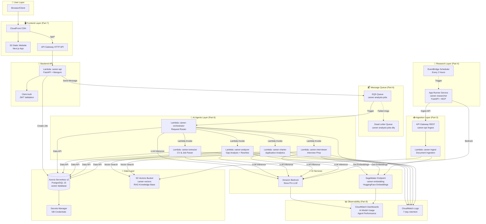
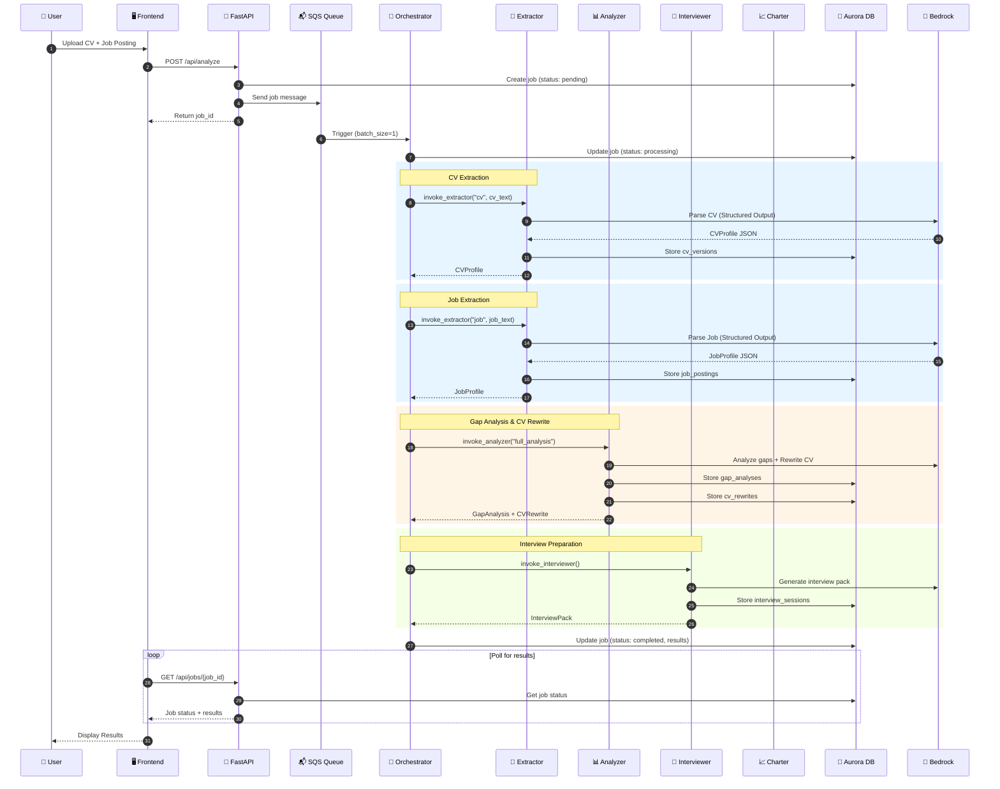
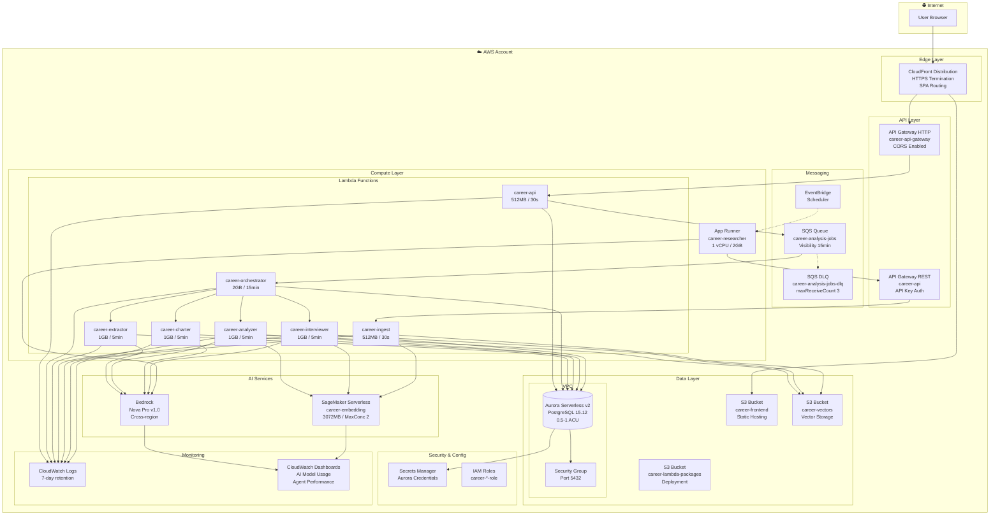
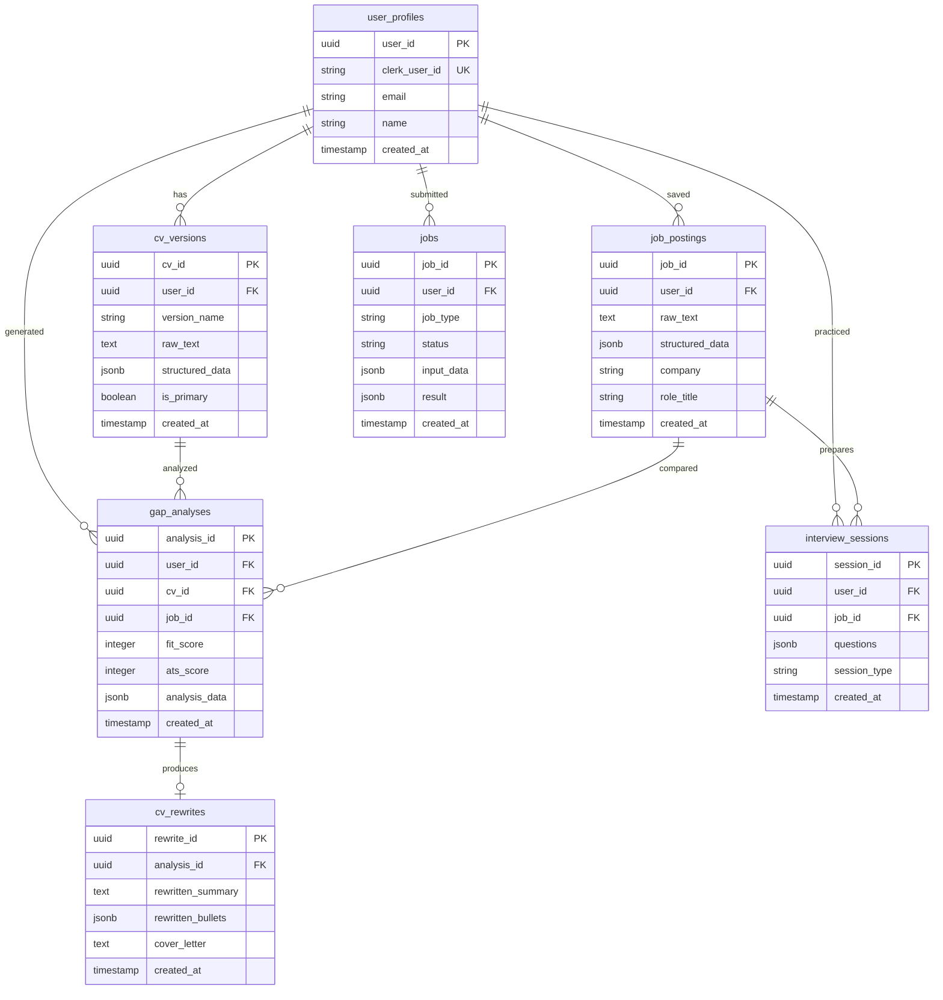
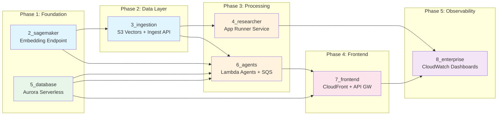
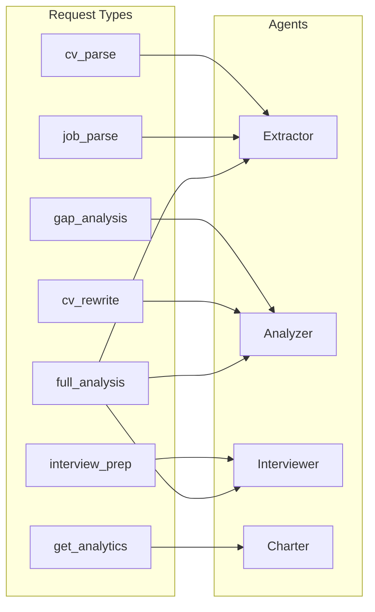

# CareerAssist - AWS Architecture Diagram

## High-Level System Architecture

---

## Agent Communication Flow

---

## AWS Infrastructure Topology

---

## Database Schema (Simplified)

---

## Terraform Deployment Order

---

## Agent Capabilities Summary

| Agent | Input | Output | Tools | AI Model |
|-------|-------|--------|-------|----------|
| **Orchestrator** | Job request | Coordinated results | `invoke_extractor`, `invoke_analyzer`, `invoke_interviewer`, `invoke_charter` | Bedrock Nova Pro |
| **Extractor** | Raw text (CV/Job) | `CVProfile` or `JobProfile` | None (Structured Outputs) | Bedrock Nova Pro |
| **Analyzer** | CV + Job profiles | `GapAnalysis` + `CVRewrite` | `get_bullet_templates`, `get_ats_keywords` | Bedrock Nova Pro |
| **Interviewer** | CV + Job + Gap | `InterviewPack` | `get_interview_questions` | Bedrock Nova Pro |
| **Charter** | User applications | Analytics charts | None | Bedrock Nova Pro |
| **Researcher** | Research topics | Research findings | `store_research`, `ingest_document`, MCP Playwright | Bedrock Nova Pro |

---

## Request Types Handled

---

*Generated: January 2026 | CareerAssist v1.0*
