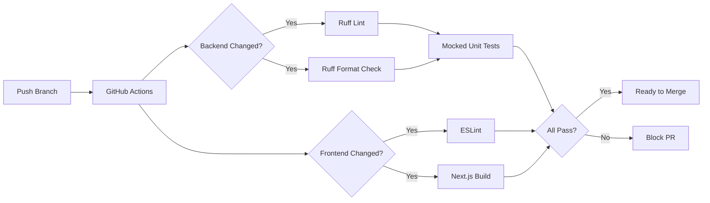
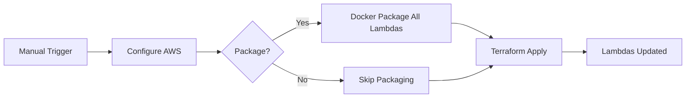

# Guide 9: CI/CD Pipeline - Automated Quality Gates, Linting & Deployment

Welcome to the CI/CD guide for CareerAssist! In this guide, we'll add professional automated quality gates that run on every pull request, enforce code standards, and streamline deployment. This is one of the first things interviewers look for in portfolio projects.

By the end of this guide, your CareerAssist project will have:

- **Linting**: Ruff enforcing consistent Python code style across all agents
- **Pre-commit hooks**: Catching issues before they reach the repository
- **GitHub Actions**: Automated CI on every pull request
- **Deployment workflow**: One-click Lambda deployment from the Actions tab
- **Developer experience**: A Makefile with shortcuts for common tasks

## REMINDER - MAJOR TIP!!

There's a file `gameplan.md` in the project root that describes the entire CareerAssist project to an AI Agent, so that you can ask questions and get help. There's also an identical `CLAUDE.md` and `AGENTS.md` file. If you need help, simply start your favorite AI Agent, and give it this instruction:

> I am a student on the course AI in Production. We are in the course repo. Read the file `gameplan.md` for a briefing on the project. Read this file completely and read all the linked guides carefully. Do not start any work apart from reading and checking directory structure. When you have completed all reading, let me know if you have questions before we get started.

After answering questions, say exactly which guide you're on and any issues. Be careful to validate every suggestion; always ask for the root cause and evidence of problems. LLMs have a tendency to jump to conclusions, but they often correct themselves when they need to provide evidence.

## Why CI/CD Matters

Without CI/CD, you're relying on every developer to manually run linters, tests, and deployments. In a multi-agent system like CareerAssist with 5+ agents, this quickly becomes unsustainable. A single uncaught import error in the Analyzer agent could break the entire pipeline.

### The PR Workflow



### The Deploy Workflow



## Step 1: Setting Up Ruff

[Ruff](https://docs.astral.sh/ruff/) is an extremely fast Python linter and formatter written in Rust. It replaces Flake8, isort, pyupgrade, and Black in a single tool.

### Configuration

The Ruff configuration lives in `backend/pyproject.toml`:

```toml
[tool.ruff]
target-version = "py312"
line-length = 120
exclude = [".venv", "build_temp", "__pycache__", ".aws-sam"]

[tool.ruff.lint]
select = ["E", "W", "F", "I", "UP", "B", "SIM"]
ignore = ["E501", "B008", "E402", "B904", "E741", "E722", "SIM102", "SIM105", "SIM108", "SIM101"]
```

Here's what each rule set catches:

| Code | Name | What it catches |
|------|------|----------------|
| `E/W` | pycodestyle | Basic style errors (whitespace, indentation) |
| `F` | pyflakes | Unused imports, undefined names, shadowed variables |
| `I` | isort | Import ordering and grouping |
| `UP` | pyupgrade | Deprecated Python syntax (e.g., `Dict` -> `dict`) |
| `B` | bugbear | Common bugs and design problems |
| `SIM` | simplify | Code that can be simplified |

And the ignores:

| Ignore | Why |
|--------|-----|
| `E501` | Line length handled by formatter |
| `B008` | FastAPI `Depends()` pattern |
| `E402` | Lambda handlers set env vars before imports |
| `B904` | `raise X from Y` is good practice but not enforced on existing code |

### Running Ruff Locally

```bash
# Check for lint issues
cd backend && uv run ruff check .

# Auto-fix issues
cd backend && uv run ruff check --fix .

# Check formatting
cd backend && uv run ruff format --check .

# Auto-format
cd backend && uv run ruff format .
```

## Step 2: Pre-commit Hooks

Pre-commit hooks run automatically before each `git commit`, catching issues locally before they reach CI.

### Installation

```bash
# Install pre-commit (if not already installed)
pip install pre-commit

# Install the hooks (reads .pre-commit-config.yaml)
pre-commit install
```

Or use the Makefile shortcut:

```bash
make setup-hooks
```

### Configuration

The `.pre-commit-config.yaml` includes:

1. **Standard hooks**: trailing whitespace, YAML validation, large file detection, private key detection
2. **Ruff**: lint + format on `backend/` files only
3. **ESLint**: runs on `frontend/` TypeScript/JavaScript files

### Testing Hooks

Run hooks on all files without committing:

```bash
pre-commit run --all-files
```

## Step 3: The Makefile

The `Makefile` provides a consistent developer experience. Instead of remembering long commands, you use short targets:

```bash
make help        # Show all available commands
make setup       # Install everything (backend + frontend + hooks)
make lint        # Run all linters (backend + frontend)
make format      # Auto-format backend code
make test        # Run mocked unit tests
make ci          # Full CI pipeline locally (lint + format-check + test)
make clean       # Remove build artifacts and caches
make deploy      # Deploy Lambda functions
```

The `make ci` target is especially useful - run it before pushing to catch everything CI would catch:

```bash
$ make ci
cd backend && uv run ruff check .
All checks passed!
cd backend && uv run ruff format --check .
84 files already formatted
cd backend && MOCK_LAMBDAS=true uv run test_simple.py
...
ALL TESTS PASSED!
```

## Step 4: GitHub Actions Workflows

We have four workflow files in `.github/workflows/`:

### `backend-ci.yml` - Backend Quality Gates

**Triggers**: PRs touching `backend/**`, pushes to `main`

Two jobs:
1. **Lint & Format Check**: Installs uv, runs `ruff check` and `ruff format --check`
2. **Unit Tests (Mocked)**: Runs `test_simple.py` with `MOCK_LAMBDAS=true` and dummy database env vars

The test job depends on lint passing first - no point running tests if the code doesn't even lint.

### `frontend-ci.yml` - Frontend Quality Gates

**Triggers**: PRs touching `frontend/**`, pushes to `main`

Single job: `npm ci` -> ESLint -> `next build`

Uses dummy Clerk environment variables so the build can complete without real auth keys.

### `deploy.yml` - Manual Deployment

**Triggers**: Manual only (workflow_dispatch)

This workflow:
1. Configures AWS credentials from repository secrets
2. Optionally re-packages all Lambda functions
3. Runs `deploy_all_lambdas.py` with Terraform

Uses a concurrency group to prevent parallel deployments.

### `integration-tests.yml` - Full E2E Tests

**Triggers**: Manual + pushes to `main` (backend changes)

Runs `test_full.py` against real AWS infrastructure. Requires the `production` environment with AWS secrets configured.

## Step 5: Repository Settings

After pushing these files, configure your GitHub repository:

### Repository Secrets

Go to **Settings > Secrets and variables > Actions** and add:

| Secret | Source |
|--------|--------|
| `AWS_ACCESS_KEY_ID` | IAM user credentials |
| `AWS_SECRET_ACCESS_KEY` | IAM user credentials |
| `AWS_REGION` | e.g., `us-east-1` |
| `DATABASE_CLUSTER_ARN` | From `terraform output` in `terraform/5_database` |
| `DATABASE_SECRET_ARN` | From `terraform output` in `terraform/5_database` |
| `DATABASE_NAME` | e.g., `career_assist` |

### Branch Protection Rules

Go to **Settings > Branches > Add rule** for `main`:

- **Require a pull request before merging**: Check
- **Require approvals**: 1
- **Require status checks to pass**: Check
  - Add: `Backend CI / Lint & Format Check`
  - Add: `Backend CI / Unit Tests (Mocked)`
  - Add: `Frontend CI / Lint & Build`

This prevents merging PRs that fail CI.

## Step 6: Testing the Pipeline

### Test Locally First

```bash
# Full CI check
make ci

# Just lint
make lint-backend

# Just format
make format-check
```

### Test on GitHub

1. Create a branch: `git checkout -b test/ci-pipeline`
2. Make a small change to any backend file
3. Push and open a PR
4. Watch the Actions tab - both Backend CI and Frontend CI should trigger
5. Verify the status checks appear on the PR

### Test Deployment

1. Go to **Actions > Deploy** in your repository
2. Click **Run workflow**
3. Choose whether to re-package
4. Monitor the workflow run

## Troubleshooting

### Ruff finds issues that `--fix` can't auto-fix

Some issues require manual intervention. Common ones:

```bash
# See what's wrong
cd backend && uv run ruff check . --show-fixes

# Apply unsafe fixes (review the changes!)
cd backend && uv run ruff check . --fix --unsafe-fixes
```

### Pre-commit hooks are slow

The first run downloads hook environments. Subsequent runs use cached environments and are much faster.

### GitHub Actions can't find uv

Make sure you're using `astral-sh/setup-uv@v4` in your workflow. This installs uv globally on the runner.

### Tests fail in CI but pass locally

Check environment variables. CI uses dummy values for database connections with `MOCK_LAMBDAS=true`. If your test tries to connect to a real database, it will fail in CI.

### Deploy workflow fails on Terraform

Ensure:
1. AWS secrets are configured in repository settings
2. The IAM user has sufficient permissions
3. `terraform.tfvars` files exist in the Terraform directories

## Architecture Deep Dive: CI/CD for Multi-Agent AI Systems

CareerAssist's architecture creates unique CI/CD challenges. Each agent (Orchestrator, Extractor, Analyzer, Charter, Interviewer) is independently deployed as a Lambda function but tightly coupled through SQS messages and shared database schemas.

### Why Mocked Tests Are Essential

In a multi-agent system, running integration tests requires all agents to be deployed and the database to be available. That's expensive and slow. The `MOCK_LAMBDAS=true` flag lets each agent test its core logic in isolation:

```python
# In test_simple.py
env['MOCK_LAMBDAS'] = 'true'  # Mocks Lambda invocations
```

This gives fast feedback on every PR while reserving full integration tests for post-merge validation.

### The Testing Pyramid for AI Agents

```
        /  Integration  \     <-- test_full.py (post-merge, real AWS)
       /   (Expensive)   \
      /                    \
     /   Mocked Unit Tests  \  <-- test_simple.py (every PR)
    /     (Fast, Isolated)   \
   /                          \
  /      Linting & Format      \ <-- ruff check/format (every PR)
 /       (Instant, Cheap)       \
```

Each layer catches different classes of bugs:
- **Linting**: Import errors, undefined variables, deprecated syntax
- **Mocked tests**: Agent logic, prompt handling, response parsing
- **Integration tests**: Cross-agent communication, database operations, end-to-end flows

## Summary

In this guide, we added a complete CI/CD pipeline to CareerAssist:

1. **Ruff** for Python linting and formatting (2400+ issues auto-fixed)
2. **Pre-commit hooks** for local quality gates
3. **Makefile** for developer experience
4. **GitHub Actions** with 4 workflows:
   - Backend CI (lint + mocked tests on PRs)
   - Frontend CI (ESLint + build on PRs)
   - Manual deployment
   - Integration tests

The pipeline follows the testing pyramid: fast linting on every commit, mocked tests on every PR, and integration tests post-merge. This catches bugs early while keeping PR feedback fast.

Next steps:
- Push these changes and verify workflows run on GitHub
- Configure repository secrets for deployment
- Set up branch protection rules
- Consider adding code coverage reporting with `pytest-cov`
